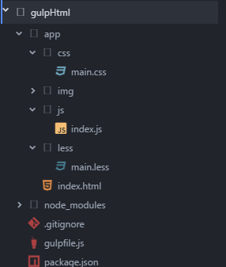

### Gulp+Less+Browsersync 构建简易前端开发环境

#### 结构目录：

#### 使用：

    npm install   // 安装依赖包
    npm run dev  // 开发环境下，未压缩
    npm run build // 生产环境，代码压缩

#### 说明：

此工具比较单一，简易，加入了BrowserSync， 运行在本地服务器上，并且代码即改即现，代码易读，注释齐全，后期可扩展性强。

Browsersync官方介绍，BrowserSync能让浏览器实时、快速响应您的文件(html、js、css、sass、less等等)的更改,BrowserSync支持多终端(PC、ipad、iphone、android等等)设备同时调试。

在开发状态下，只做了less转css的操作。 
在生产环境下，通过gulp-clean-css ，gulp-htmlmin，gulp-uglify，gulp-imagemin， imagemin-pngquant， gulp-cache对css,html,js,image进行代码压缩了。
